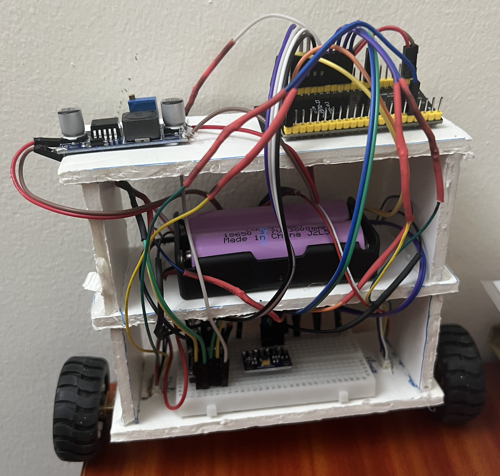
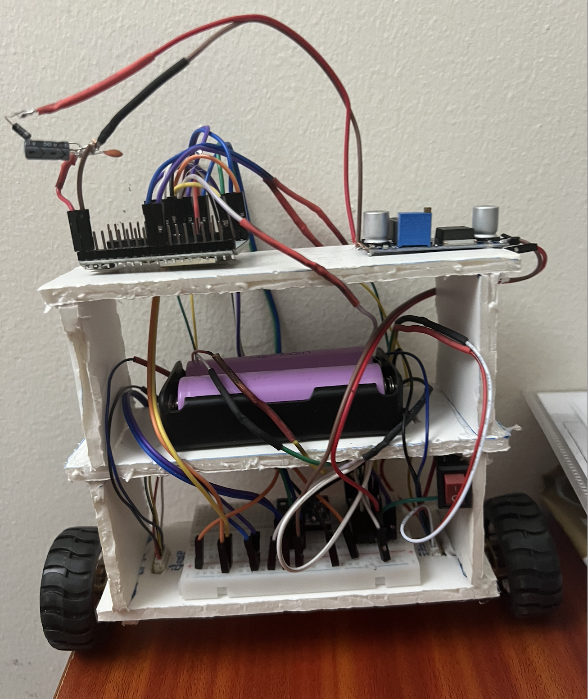
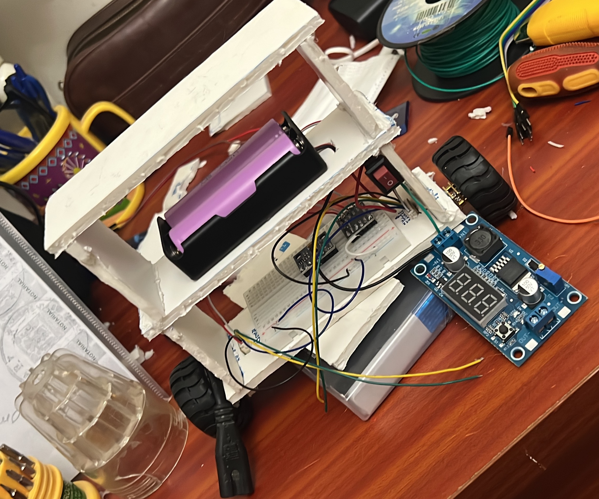
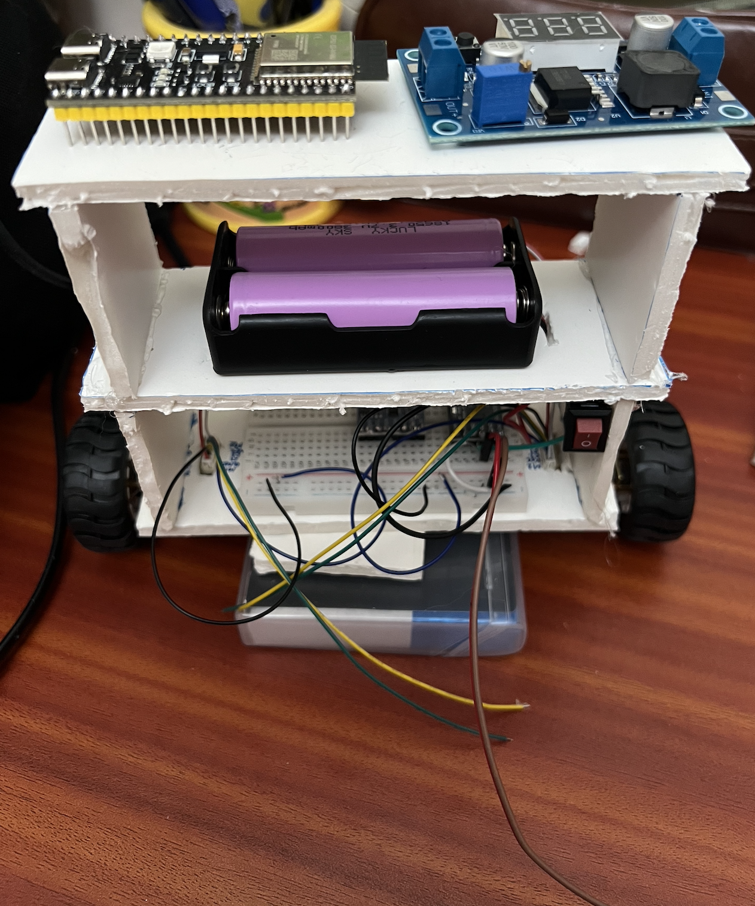
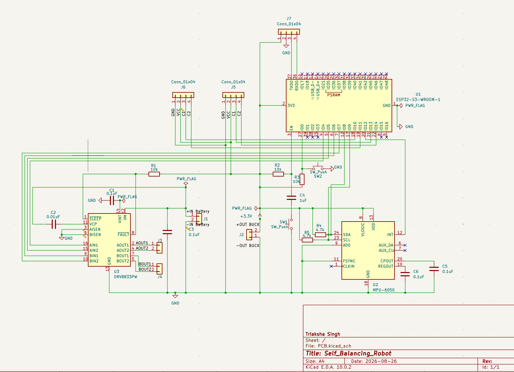
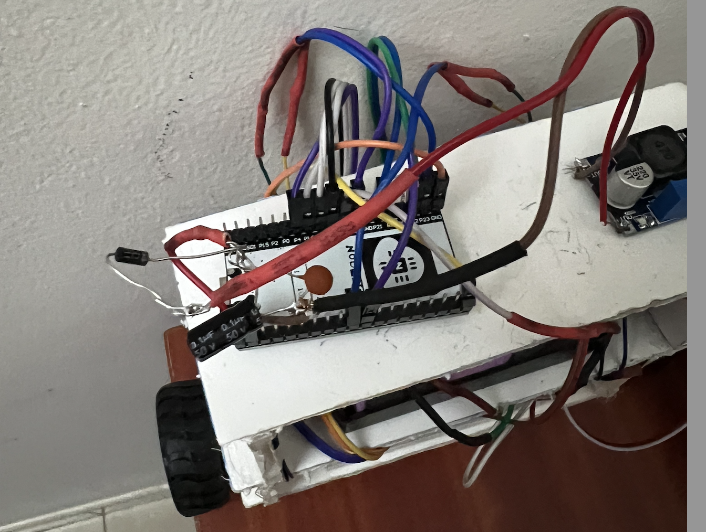

# Self-Balancing Robot

A two-wheeled inverted-pendulum robot built around a NodeMCU ESP-32S. The
board carries the MCU, an IMU, a dual H-bridge motor driver and the power rail;
firmware fuses accelerometer and gyroscope readings into a tilt angle and runs a
PID loop that drives the wheels to keep the chassis upright.




**During Build**




## Contents

| Path | What's in it |
| --- | --- |
| [PCB/](PCB/) | KiCad 10 project — schematic, board file, project settings |
| [self_balancing_robot_code/self_balancing_robot_code/](self_balancing_robot_code/self_balancing_robot_code/) | Main balancing firmware (Arduino sketch) |
| [self_balancing_robot_code/mpu6050_calibration_only/](self_balancing_robot_code/mpu6050_calibration_only/) | Standalone sketch for finding the upright angle offset |
| [images/](images/) | Build photos and a schematic render |

## Hardware

| Part | Role |
| --- | --- |
| NodeMCU ESP-32S | Main controller, USB programming |
| MPU-6500 (MPU-6050 footprint) | 6-axis IMU over I²C at `0x68` |
| DRV8833PW | Dual H-bridge, drives both gearmotors |
| 2× geared DC motors with quadrature encoders | Drive and wheel odometry |
| Passives | 4.7 kΩ I²C pull-ups, 10 kΩ pull-ups, 0.1 µF / 1 µF / 0.01 µF decoupling |
| Power protection | Backfeed-blocking diode + parallel decoupling capacitors on the 5V rail (added after a brownout incident — see Debugging Notes) |
| 3× push buttons | Boot, reset, user |

The MPU-6500 is pin- and register-compatible with the MPU-6050 footprint used in
the schematic, so the same land pattern works for either part.

### Pin map

GPIO numbers used in the firmware, for the NodeMCU ESP-32S:

| Signal | GPIO |
| --- | --- |
| I²C SDA | 21 |
| I²C SCL | 22 |
| DRV8833 `AIN1` / `AIN2` | 4 / 16 |
| DRV8833 `BIN1` / `BIN2` | 17 / 5 |
| DRV8833 `STBY` | 18 |
| Left encoder `C1` / `C2` | 19 / 23 |
| Right encoder `C1` / `C2` | 25 / 26 |

## PCB



## Firmware

Built with the Arduino core for ESP32. Only the bundled `Wire` library is
needed — the IMU is talked to over raw register reads rather than a vendor
driver.

**Arduino IDE setup**

1. Install the ESP32 board package (Boards Manager → *esp32* by Espressif).
2. Select board **NodeMCU-32S**.
3. Set the serial monitor to **115200 baud**.

### How it works

- The IMU is configured for ±4 g and ±500 °/s with the on-chip DLPF enabled.
- `atan2(ax, az)` gives an absolute but noisy tilt angle from the accelerometer;
  the gyro gives a clean but drifting rate.
- A complementary filter blends them at 98 % gyro / 2 % accelerometer each cycle.
- Tilt error feeds a PID controller whose output is written to both motors as a
  signed PWM value.
- If tilt exceeds `FALL_LIMIT` (45°), the motors are cut and the integrator is
  reset so the robot doesn't lurch when picked up.

### Calibration

The robot's "upright" reading is mechanical, not zero, so it has to be measured
once per build.

1. Flash [mpu6050_calibration_only.ino](self_balancing_robot_code/mpu6050_calibration_only/mpu6050_calibration_only.ino),
   hold the robot exactly upright and still, and read the printed `angleOffset`.
   (The main sketch can do the same thing — set `CALIBRATE_ONLY` to `1`.)
2. Put that number into `HARDCODED_OFFSET` in
   [self_balancing_robot_code.ino](self_balancing_robot_code/self_balancing_robot_code/self_balancing_robot_code.ino#L31).
3. Set `CALIBRATE_ONLY` back to `0` and re-flash.

Gyro bias is measured automatically at every boot — leave the robot still for
the couple of seconds after reset while it averages 1000 samples.

### Tuning

Gains live at the top of the main sketch:

```cpp
float Kp = 45;
float Ki = 80;
float Kd = 1.2;
```

Start with `Kp` alone and raise it until the robot oscillates around upright,
then add `Kd` to damp the oscillation, and only then a small `Ki` to remove
steady-state lean. The loop prints tilt, gyro rate, output and both encoder
counts every 100 ms for tuning.

## Debugging Notes

A few real problems came up during this build, kept here because they're more
useful than a clean success story:

- **Arduino IDE partition scheme error** —
  `{build.partitions}.csv: No such file or directory`. Caused by a generic
  "ESP32 Family Device" board selection rather than the specific
  "ESP32S3 Dev Module" — board-specific menus like Partition Scheme don't
  populate until the exact board is selected.
- **Serial Monitor showing nothing, despite working code** — traced through a
  full diagnostic chain (OS-level port detection → Blink-only test →
  Blink+Serial combined test) before finding the actual fault.
- **The real bug: a clone IMU chip.** The MPU6050 breakout actually carries an
  **MPU-6500** — a compatible but distinct sensor that responds on the I²C bus
  (confirmed with a full address scanner) but reports a different `WHO_AM_I`
  value (`0x70` instead of the expected `0x68`). Libraries that strictly check
  this ID (e.g. Adafruit_MPU6050) refuse to initialize on the mismatch even
  though the sensor works fine. Fixed by dropping the library and reading the
  accelerometer/gyro registers directly over raw I²C — the MPU-6500 is
  register-compatible for this purpose.
- **A defective buck converter trimmer pot** — one LM2596 module's adjustment
  range topped out around 7.85 V instead of reaching 5 V, confirmed by feel (a
  mechanical "tick" at the end of its travel) and multimeter cross-checking
  rather than trusting the module's onboard display alone.
- **ESP32-S3 damaged by a brownout loop.** After the board overheated during
  earlier testing, it started rejecting every new firmware upload with
  `Failed to connect to ESP32-S3: No serial data received` — even the manual
  BOOT+RESET bootloader-entry sequence didn't recover it. The board's onboard
  LED was blinking fast and erratically on every power-up, which is the
  classic signature of a **brownout reset loop**: the chip's built-in
  protection resetting it over and over because supply voltage keeps dipping
  below a safe threshold, before it can ever finish booting far enough to
  accept a connection. To confirm whether the instability was coming from the
  board itself or from something in the external wiring, every peripheral
  (IMU, motor driver, encoders) was disconnected and the board powered on
  USB alone — the fast flickering continued completely unchanged, isolating
  the fault to the board itself, most likely a damaged onboard voltage
  regulator no longer able to hold a stable output.

  **Fix:** replaced the board with a NodeMCU ESP-32S, and added protection
  against a repeat — a backfeed-blocking diode in series on the 5V rail (so
  USB power and battery-fed power can never fight each other if both happen
  to be connected at once) plus two decoupling capacitors in parallel (a
  small 0.1 µF ceramic for fast noise, a larger electrolytic as a bulk
  reservoir against slower current dips from the motors). The diode went in
  backwards on the first attempt — reversed, it blocks current entirely
  rather than just dropping voltage, which showed up as 0V instead of the
  expected small drop, and was caught by measuring voltage on both sides of
  it before and after flipping its orientation. The buck converter's output
  was also nudged up slightly afterward, to compensate for the diode's own
  forward voltage drop and keep the ESP32-S3 comfortably within its safe
  input range under load rather than right at the edge of it.

  

## License

[MIT](LICENSE)
